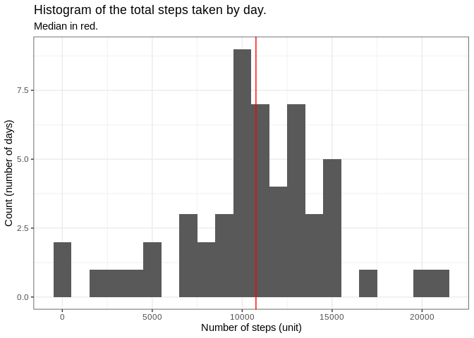
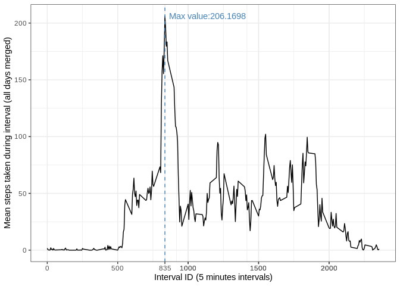
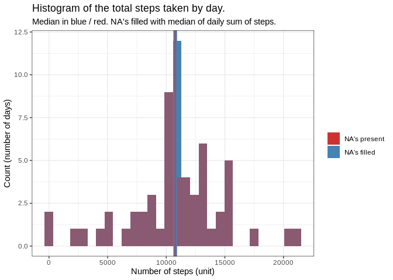
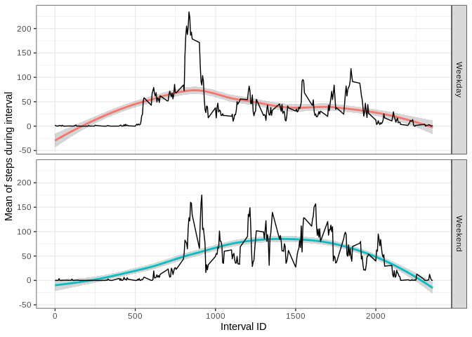

The file "activity.zip" was originally from [this url](https://d396qusza40orc.cloudfront.net/repdata%2Fdata%2Factivity.zip).

## Loading and preprocessing the data
We start by unzipping the file and loading the csv file within.

```r
unzip("activity.zip")
act_raw <- read.csv("activity.csv")
```
We then take a look on what's inside:

```r
str(act_raw); summary(act_raw)
```

```
## 'data.frame':	17568 obs. of  3 variables:
##  $ steps   : int  NA NA NA NA NA NA NA NA NA NA ...
##  $ date    : Factor w/ 61 levels "2012-10-01","2012-10-02",..: 1 1 1 1 1 1 1 1 1 1 ...
##  $ interval: int  0 5 10 15 20 25 30 35 40 45 ...
```

```
##      steps                date          interval     
##  Min.   :  0.00   2012-10-01:  288   Min.   :   0.0  
##  1st Qu.:  0.00   2012-10-02:  288   1st Qu.: 588.8  
##  Median :  0.00   2012-10-03:  288   Median :1177.5  
##  Mean   : 37.38   2012-10-04:  288   Mean   :1177.5  
##  3rd Qu.: 12.00   2012-10-05:  288   3rd Qu.:1766.2  
##  Max.   :806.00   2012-10-06:  288   Max.   :2355.0  
##  NA's   :2304     (Other)   :15840
```
From this we realize:  
A) There are missing values in the "steps" variable.
B) The dates are factors. Not that bad, but the best  
thing to do is to convert them to actual dates.

```r
act_pro <- transform(act_raw, date = as.Date(date, "%Y-%m-%d"))
```
Let's check this out:

```r
str(act_pro)
```

```
## 'data.frame':	17568 obs. of  3 variables:
##  $ steps   : int  NA NA NA NA NA NA NA NA NA NA ...
##  $ date    : Date, format: "2012-10-01" "2012-10-01" ...
##  $ interval: int  0 5 10 15 20 25 30 35 40 45 ...
```

## What is mean total number of steps taken per day?
For this, we will need additionnal packages:

```r
library(dplyr)
library(ggplot2)
```
We start by grouping the data by date, we will do this by creating a new  
dataframe:

```r
df_by_day <- act_pro %>% group_by(date) %>% 
        summarise(steps_by_day = sum(steps, na.rm = F),
                  nb_NA = sum(is.na(steps)))
table(df_by_day$nb_NA)
```

```
## 
##   0 288 
##  53   8
```
The variable "nb_NA" clearly shows the repartition of the NA's : Either a  
day has 288 values (one by interval) or none (288 NA's). This will help us  
in the future.  

For now, we want a histogram of the steps taken each day. This will show the  
repartition of the sums.

```r
hist1 <- qplot(steps_by_day, data = df_by_day, binwidth = 1000)+
        ylab("Count (number of days)")+
        xlab("Number of steps (unit)")+
        labs(title = "Histogram of the total steps taken by day.",
             subtitle = "Median in red.")+
        geom_vline(xintercept = median(df_by_day$steps_by_day, na.rm = T),
                   color = 2) +
        theme_bw()
        print(hist1)
```

```
## Warning: Removed 8 rows containing non-finite values (stat_bin).
```

<!-- -->

A quick call to summary will tell us more about the mean and median.

```r
summary(df_by_day$steps_by_day)
```

```
##    Min. 1st Qu.  Median    Mean 3rd Qu.    Max.    NA's 
##      41    8841   10765   10766   13294   21194       8
```
We can clearly see that the totals gravitate around the median (see above)  
with a rather central distribution pattern.

## What is the average daily activity pattern?
There we need a new data frame grouped by intervals, getting the mean and  
median for each of the groups. Let's do this and take a look.

```r
df_inter <- act_pro %>%
        group_by(interval) %>%
        summarise(mean_by_interval = round(mean(steps, na.rm = T), 4),
                  median_by_interval = round(median(steps, na.rm = T), 4),
                  sd_by_interval = round(sd(steps, na.rm = T), 4))
head(df_inter, 10)
```

```
## # A tibble: 10 x 4
##    interval mean_by_interval median_by_interval sd_by_interval
##       <int>            <dbl>              <dbl>          <dbl>
##  1        0           1.72                    0          7.98 
##  2        5           0.340                   0          2.47 
##  3       10           0.132                   0          0.962
##  4       15           0.151                   0          1.10 
##  5       20           0.0755                  0          0.549
##  6       25           2.09                    0          8.76 
##  7       30           0.528                   0          3.85 
##  8       35           0.868                   0          6.32 
##  9       40           0                       0          0    
## 10       45           1.47                    0          9.91
```
We can easily extract the highest value with the **which.max** function to know  
which of the intervals has the highest mean and store this into variables.

```r
max_index <- which.max(df_inter$mean_by_interval)
max_interval <- as.numeric(paste(df_inter$interval[max_index]))
max_mean <- df_inter$mean_by_interval[max_index]
print(df_inter[max_index,])
```

```
## # A tibble: 1 x 4
##   interval mean_by_interval median_by_interval sd_by_interval
##      <int>            <dbl>              <dbl>          <dbl>
## 1      835             206.                 19           293.
```
We then construct the plot with the help of the variables  
**max_interval & max_mean** to help make the max value clear:

```r
g1 <- ggplot(df_inter, aes(as.numeric(paste(interval)), mean_by_interval))+ 
        geom_line() +
        theme_bw() +
        ylab("Mean steps taken during interval (all days merged)") +
        xlab("Interval ID (5 minutes intervals)") +
        geom_vline(xintercept = max_interval, color = "steelblue", lty = 2) +
        scale_x_continuous(breaks = c(seq(from= 0, to = 2000, by=500),
                                      max_interval,
                                      seq(from= 1000, to = 2000, by=500))) +
        annotate(geom = "text",
                 x = max_interval+300,
                 y = max_mean,
                 label = paste0("Max value:", max_mean),
                 color = "steelblue")
g1
```

<!-- -->

## Imputing missing values
From the previous exploration, we can see many variations in term of values  
during one day, it makes more sense to me to replace the NA's with the mean  
or median of their **interval** across all days.  
  
If we take a look at the standard deviations of each interval group, we can  
also see that they sometimes go pretty high, further encouraging the use of  
the median to be as representative as possible of an "average day".

For this, we will use the previously created **df_by_day** data frame.  
df_by_day contains exactly 61 lines, one per day, along with the  
matching sum of steps (or NA) in the variable steps_by_day. We will simply  
transform the NA's into the median of the steps_by_day variable.


```r
df_by_day_compl <- transform(df_by_day, 
                       steps_by_day = ifelse(is.na(steps_by_day),
                                             median(steps_by_day, na.rm = T),
                                             steps_by_day))
df_by_day_compl <- df_by_day_compl[,-3]
```
  
Then we can construct the plot:

```r
hist2 <- ggplot()+
        geom_histogram(data = df_by_day_compl, aes(steps_by_day, fill = "steelblue")) +
        geom_histogram(data = df_by_day, aes(steps_by_day, fill = "brown3"), alpha = 0.5) +
        ylab("Count (number of days)")+
        xlab("Number of steps (unit)")+
        labs(title = "Histogram of the total steps taken by day.",
             subtitle = "Median in blue / red. NA's filled with median of daily sum of steps.")+
        geom_vline(xintercept = median(df_by_day_compl$steps_by_day),
                   color = "steelblue", lwd = 2.2)+ 
        geom_vline(xintercept = median(df_by_day$steps_by_day, na.rm = T),
                   color = "brown3", lwd = 1.2, alpha = 0.5)+
        scale_fill_manual(values = c("brown3", "steelblue"), labels = c( "NA's present", "NA's filled"),
                          name = NULL) +
        theme_bw()
hist2
```

```
## `stat_bin()` using `bins = 30`. Pick better value with `binwidth`.
## `stat_bin()` using `bins = 30`. Pick better value with `binwidth`.
```

```
## Warning: Removed 8 rows containing non-finite values (stat_bin).
```

<!-- -->
  
If we take a look at the histograms, we can see that filling the NA's with  
"basic" approaches such as means or medians tend to centralize data, hence  
eventually skewing group tendencies by pulling the 1st and 3rd quartiles  
towards the median.  
  
The histogram shows that the corrected and uncorrected datasets overlap on all  
but one column which is the one where the median(s) are.

It becomes more obvious when we look at the summary with NA replaced:

```r
summary(df_by_day_compl$steps_by_day)
```

```
##    Min. 1st Qu.  Median    Mean 3rd Qu.    Max. 
##      41    9819   10765   10766   12811   21194
```
... in comparaison with the original values (see above) with NA's:

```r
summary(df_by_day$steps_by_day)
```

```
##    Min. 1st Qu.  Median    Mean 3rd Qu.    Max.    NA's 
##      41    8841   10765   10766   13294   21194       8
```

So unless needed for some kind of model, I would leave the NA's as is.


## Are there differences in activity patterns between weekdays and weekends?

First thing, we will add the variable **weekday** to the act_pro dataframe and add another  
variable, **day_group**   which will be used as the main group_by variable.


```r
act_pro <- transform(act_pro, weekday = weekdays(date, abbreviate = F))

## This line is a cheap way to be sure to catch the weekend days names even if the system is in a different
## language
weekend_days <- c(weekdays(as.Date("2019-09-28")), weekdays(as.Date("2019-09-29")))
####

act_pro <- transform(act_pro, day_group = ifelse(act_pro$weekday %in% weekend_days, "Weekend", "Weekday"))
table(act_pro$day_group)
```

```
## 
## Weekday Weekend 
##   12960    4608
```
  
We can see that (as expected) there are more weekdays than weekend days.
Let's create the graph:

```r
g2 <- act_pro %>%
    group_by(interval, day_group) %>%
    summarize(mean_steps = mean(steps, na.rm = T)) %>%
    ggplot(., aes(interval, mean_steps)) +
    geom_smooth(aes(color = day_group), method = "loess") +
    geom_line() + facet_grid(day_group~.) + theme_bw() +
    theme(legend.position = "none") +
    ylab("Mean of steps during interval") + xlab("Interval ID")
g2
```

<!-- -->
  
We have a clear answer here: There **IS** a rather evident shift in activity pattern  
between weekdays and weekend. The activity is shifted towards higher Interval  
ID's (aka: later in the day) and is higher in these later timepoints.  
The overall mean of activity is also higher during the weekends as seen below:


```r
mean_wd <- mean(act_pro$steps[act_pro$day_group == "Weekday"], na.rm = T)
mean_we <- mean(act_pro$steps[act_pro$day_group == "Weekend"], na.rm = T)
names(mean_wd) <- "Mean during Weekdays"
names(mean_we) <- "Mean during Weekends"
mean_wd;mean_we
```

```
## Mean during Weekdays 
##             35.33796
```

```
## Mean during Weekends 
##             43.07837
```
  
The conclusion is that the activities seem to start later during the day on  
weekend but make for it with intensity.
